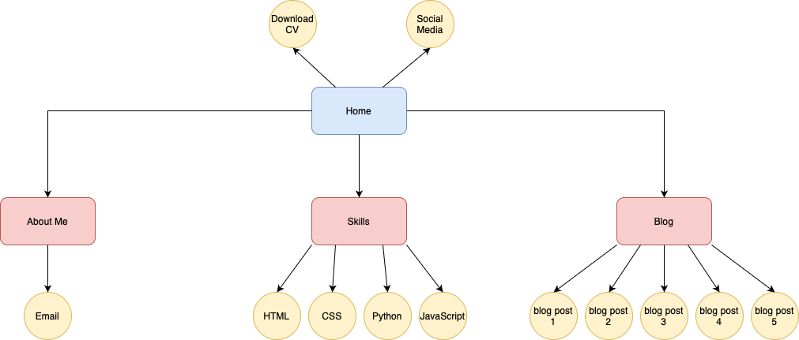
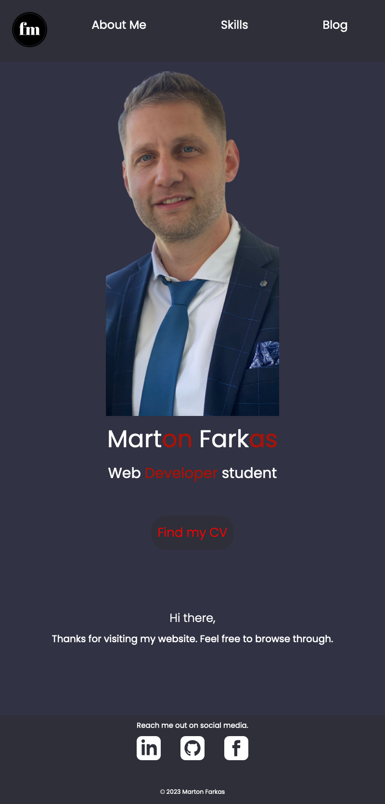
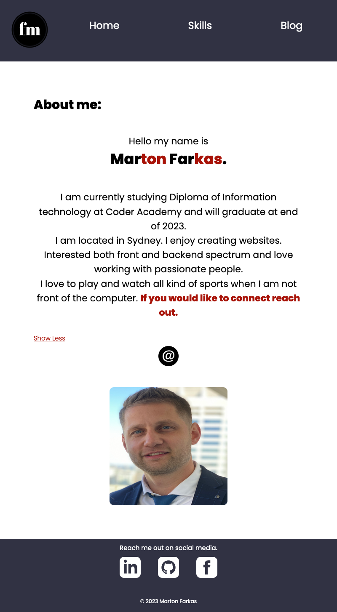
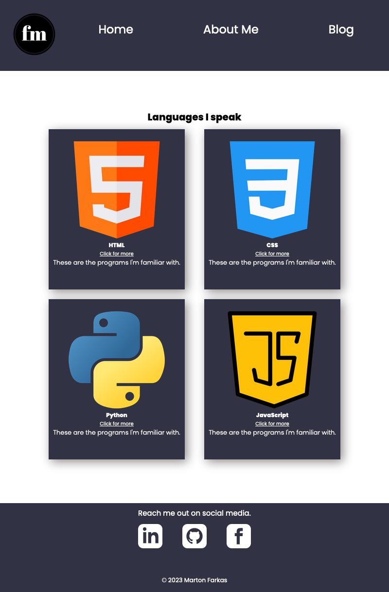
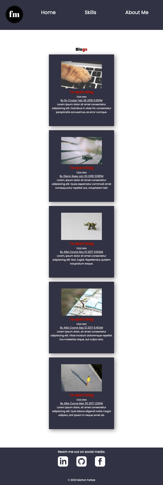

# **Links**

[website](https://portfolio-website-kq4x5tmw7-martonfarkas.vercel.app)

[website](https://portfolio-website-lilac-two.vercel.app)

[github_repo](https://github.com/martonfarkas/portfolio-website/tree/main)

[presentation](https://www.loom.com/share/ba75170c47e04088ab6b8f7669fd9b33)

# **Portfolio**

## - Purpose

- The purpose of this website to showcase my HTML and CSS skills and introduce myself as a web developer.

- To the right audience be able to contact me and see my work.

## - Features

- The portfolio website contains 1 home page and 3 side pages

- Home page features contact details, my CV

- About me page is an introduction where visitors able to get to know a little about me

- Skills page contains the programs I am familiar with and links to those programs and languages

* Blogs page includes links to various IT blogs

* All pages have links to social media accounts

## - Sitemap

- 

## - Screenshot

- 

- 

- 

- 

## - Target audience

- My target audience is mostly web developers and people from the IT industry

## - Tech stack I have used in this project

- HTML
- CSS
- GitHub
- Vercel
